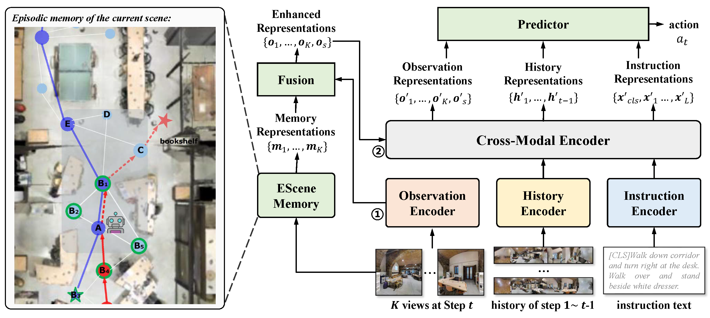

# ESceme: Vision-and-Language Navigation with Episodic Scene Memory ([PDF]())

In this work, we introduce a mechanism of Episodic Scene memory (ESceme) for VLN that wakes an agent's memories of past visits when it enters the current scene. The episodic scene memory allows the agent to envision a bigger picture of the next prediction. In this way, the agent learns to make the most of currently available information instead of merely adapting to the seen environments. We provide a simple yet effective implementation by enhancing the observation features of candidate nodes during training. We verify the superiority of ESceme on three VLN tasks, including short-horizon navigation (R2R), long-horizon navigation (R4R), and vision-and-dialog navigation (CVDN), and achieve a new state-of-the-art.



## Fine-tuning on R2R, R4R, and CVDN datasets
```fine-tune
cd finetune_src
bash scripts/run_r2r_hamt_esceme.bash
bash scripts/run_r4r_hamt_esceme.bash
bash scripts/run_cvdn_esceme.bash
```
